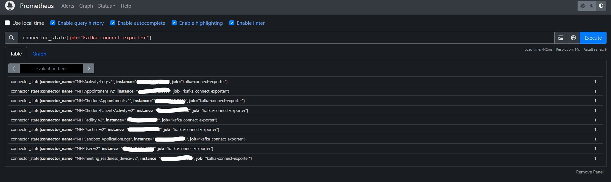
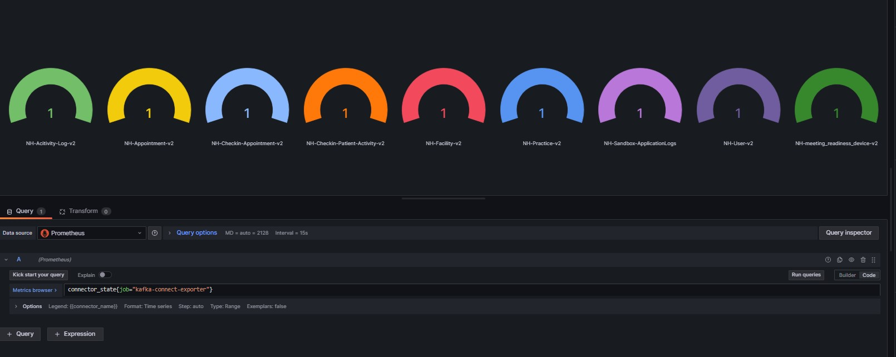

# 📊 Prometheus-Kafka_Mongo-SourceConnector-Exporter


A lightweight Prometheus exporter that dynamically discovers and monitors all Kafka Connect connectors via the Kafka Connect REST API.

---

## ✅ Features

- 🔍 **Dynamic connector discovery** — no hardcoding required
- 🚦 **Status metrics** (`RUNNING` = 1, any other = 0)
- 📈 Prometheus-compatible `/metrics` endpoint
- 💡 Configurable via `.env` file
- 🐳 Easy deployment using Docker Compose

---

## 🧰 Prerequisites

Before using this exporter, make sure you have:

- A running **Kafka Connect** Server (locally or network accessible)
- **Docker** and **docker-compose** installed
- A **Prometheus** server (to scrape and visualize metrics)

---

## ⚙️ Step-by-Step Setup

### 1. 🚀 Clone the repository

```bash
git clone https://github.com/fahadmuzzamil/Prometheus-Kafka_Mongo-SourceConnector-Exporter.git
cd Prometheus-Kafka_Mongo-SourceConnector-Exporter
```
### 2. ✏️ Configure `.env` file
Edit the `.env` file and replace with your actual Kafka Connect host:
```
KAFKA_CONNECT_URL=http://0.0.0.0:8083
```

### 3. 🚀 Run the Exporter
```
docker-compose up --build -d
```
### 4. 📡 Access Metrics
```
curl -X GET http://localhost:8001/metrics
```

### (Optional) Configure a Prometheus Job in prometheus.yml file:
```
  scrape_configs:
  - job_name: 'kafka-connect-exporter'
    static_configs:
      - targets: ['localhost:8001']
```

---
## Images for refrence:
Prometheus Query:


Grafana Dashbaord:


---
## 📝 License

This project is licensed under the **MIT License** — you are free to use, modify, and distribute it.

See the [LICENSE](./LICENSE) file for details.

---

## 📬 Contact & Feedback

If you have any questions, suggestions, or would like to collaborate, feel free to connect with me on [LinkedIn](www.linkedin.com/in/fahad-muzzamil-849262194).

> 💡 I'm always happy to discuss Kafka, DevOps, and open source contributions!

